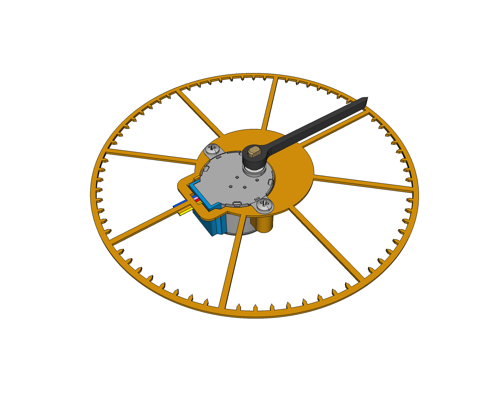
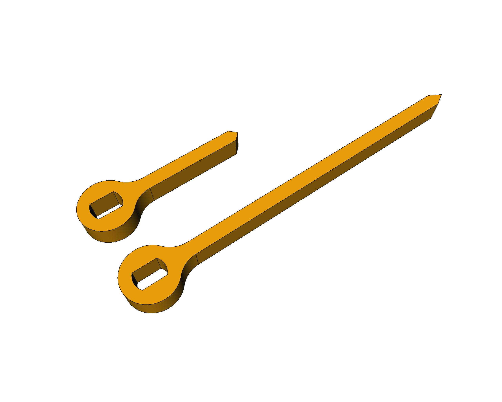

# 28BYJ-48 steppers stuff - 3D models

There are a couple of 3D models here, created with the ope-source software [FreeCAD](https://freecad.org):

* An indexed dial divided in 5 degrees steps:

* The stepper hand in short and long format:

All already available in **STL** format, ready to be 3D printed.

## LICENSE

This work is licensed under the [GNU General Public License v3.0](LICENSE-GPLV30). All media and data files that are not source code are licensed under the [Creative Commons Attribution 4.0 BY-SA license](LICENSE-CCBYSA40).

More information about licenses in [Opensource licenses](https://opensource.org/licenses/) and [Creative Commons licenses](https://creativecommons.org/licenses/).