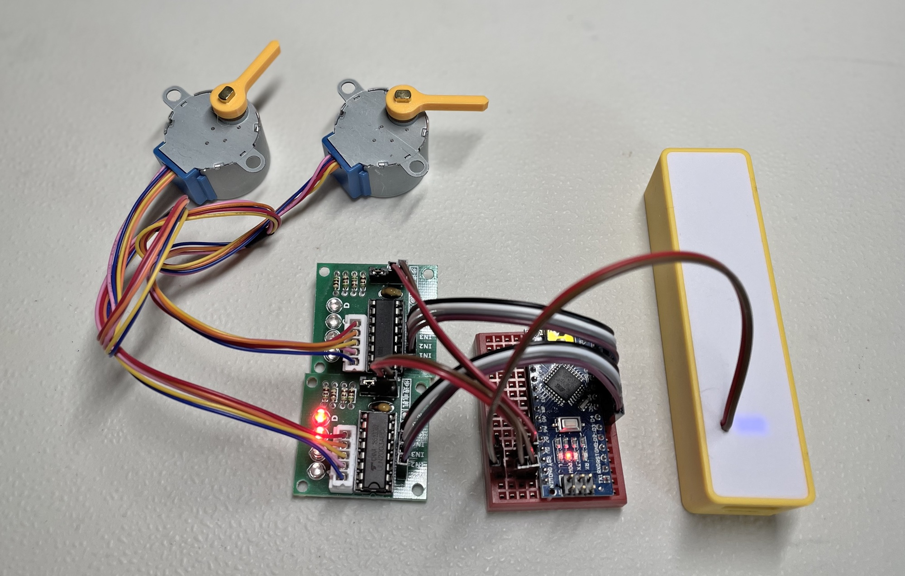
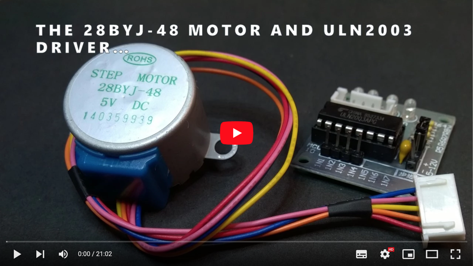
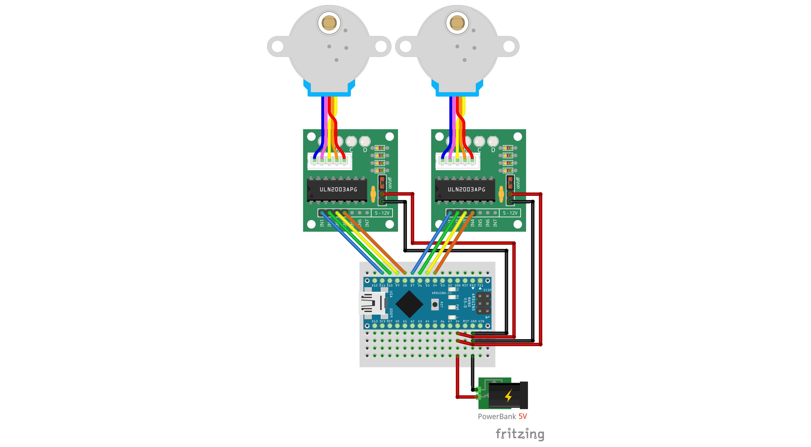
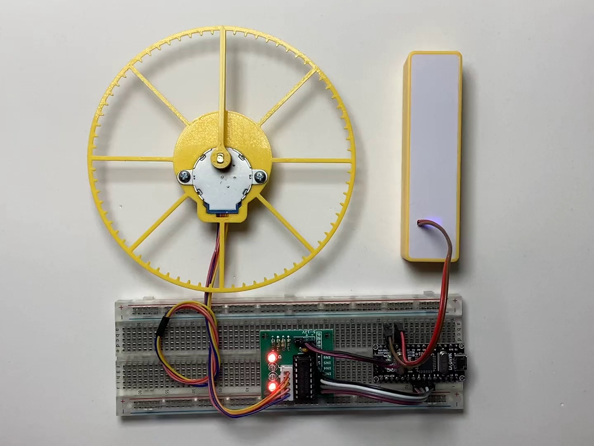

# 28BYJ-48 steppers stuff (WIP)
A recopilation of **28BYJ-48** stepper motor + **ULN2003** driver *experiments*, *checks*, *analysis*, *documentation*, *models* and *data*, mainly for my own reference. Feel free to explore the contents of this repository.

## "THE" BIBLE
This is, in my opinion, one of the best explanations about the **28BYJ-48 + ULN2003** stepper motor + driver combo, by [Bret Stateham](https://github.com/BretStateham):

There is also a very complete web page with very detailed information and explanations 
about the 28BYJ-48 stepper motor here:
[https://cookierobotics.com/042/](https://cookierobotics.com/042/)

## INFO

28BYJ-48 is an inexpensive unipolar stepper motor with 4 phases and 5 wire connection,
normally driven using a ULN2003 Darlington transistors array IC.

### Gears

The 28BYJ-48 comes with a reduction gear box. Each gear connects with the following in order:

* Motor shaft: 9 teeth
* 1st gear: 32/11 teeth (32:9)
* 2nd gear: 22/9 teeth (22:11)
* 3rd gear: 26/10 teeth (26:9)
* Output shaft: 31 teeth (31:10)

  `Ratio = 32/9 * 22/11 * 26/9 * 31/10 = 63,6840  ~ 64:1`

### Stepping

The motor shaft has attached a cylindrical permanent magnet. Surrounding it there
are two coils in
[unipolar configuration](https://en.wikipedia.org/wiki/Stepper_motor#Unipolar_motors)
 (i.e., with a common middle connection point), which implies 4 different phases.

The same casing metal is used as the electromagnetic core for the coils:

* 32 small metal tabs (or *teeth*)
* spread evenly across 360° (11,25° separate each two tabs)
* intermixed and distributed in two layers (1 per coil): 8x8 - 8x8

**Stepping modes:**
* Wave: one phase each time (4-step sequence)
* Full: two phases each time (4-step sequence)
* Half: alternating one and two phases (8-step sequence)

**Additional stepping info:**
* Internal motor step angle in 4-step sequence: 11.25° (32 steps per revolution)
* Internal motor step angle in 8-step sequence: 5.625° (64 steps per revolution)
* Steps per output shaft revolution in 4-step sequence: 32 * 63,6840 = 2037,8864 (~2038)
* Steps per output shaft revolution in 8-step sequence: 2 * 32 * 63,6840 = 4075,7728 (~4076)
* Frequency: 100Hz
* Idle In-traction Frequency: > 600Hz
* Idle Out-traction Frequency: > 1000Hz
* In-traction Torque: > 34.3 mN·m (120Hz) 
* Self-positioning Torque: > 34.3 mN·m
* Friction torque: 600-1200 gf.cm
* Pull in torque: 300 gf·cm

### Electrical characteristics
* Number of Phase: 4
* Rated voltage: 5V DC (there are 12V versions too)
* Current consumption (measured at the the ULN2003 driver module entry point): ~165 mA one
  phase powered, ~315 mA two, ~450 mA three, ~570 mA all four
* DC resistance: 50 Ω ± 7% (25°C)
* Insulated resistance: > 10 MΩ (500 V)
* Insulated electricity power: 600 VAC / 1 mA / 1 s
* Insulation grade: A
* Wiring: A (Blue), B (Pink), C (Yellow), D (Orange), E (Red, common Vcc). NOTE: It's
  well know that some units may come with swaped cables: Pink, Blue, Orange, Yellow & Red.

### Other parameters
* Rise in Temperature: < 40 K (120Hz)
* Noise: < 35 dB (120Hz, No load, 10cm)
* Weight: 30g

### Datasheets
Some datasheet documents are available in the `datasheet` folder.

## SCHEMAS

In the `schemas` folder:

## CODE

### PORTx vs digitalWrite()

To be able to set the four coils **simultaneously** we can use the [**PORTx registers**](https://docs.arduino.cc/hacking/software/PortManipulation). Also it is a lot faster (2.6x times in my example!) than the [**digitalWrite()**](https://www.arduino.cc/reference/en/language/functions/digital-io/digitalwrite/) counterpart. It's true that the code is more difficult to maintain.

Take a look at the `2X-stepper-portx.ino` and `2X-stepper-digitalwrite.ino` Arduino programs for the comparison:

    Stepper motors (ULN2003 + 28BYJ-48) driving using PORTx registers
    Maximun setCoils() time: 0
    Mode: WAVE  Delay: 2250
    Maximun setCoils() time: 28

    Stepper motors (ULN2003 + 28BYJ-48) driving using digitalWrite()
    Maximun setCoils() time: 0
    Mode: WAVE  Delay: 2250
    Maximun setCoils() time: 72

### WAVE vs FULL vs HALF driving models

There are three ways to drive a **28BYJ-48 stepper motor**. In the `visualize-driving.ino` Arduino program there is a visual demonstration on how the different driving modes operate: steps are executed very slowly as to see which coils are **on** or **off** every time.

* **WAVE**: 4-step sequence with only one active coil for each step. Good to **save energy**.
* **FULL**: 4-step sequence with two active coils at the same time for every step. Good for the **strongest torque**.
* **HALF**: 8-step sequence with alternating one or two active coils every step. You get the **finest resolution** (2x).

### FULL ROTATION

In **full drive mode**, the theoretical number of steps to perform a full output shaft rotation is **2037,8864** (not even a integer number!), but in the *practical world*, that number is a little higher (**2048**) as you can see in the test code and the following video:

This difference may be caused by different factors: manufacturing, gear teeth engagement, missed steps, etc.

The code and the 3D printable models for this test are available in their respective folders in case you want to calibrate your own stepper motors.

## 3D models

Go take a look at my [FreeCAD repository](https://github.com/mgesteiro/FreeCAD-models) for these models:

## Fritzing Parts

Go take a look at my [Fritzing repository](https://github.com/mgesteiro/fritzing-parts) for these parts:

## LICENSE

This work is licensed under the [GNU General Public License v3.0](LICENSE-GPLV30). All media and data files that are not source code are licensed under the [Creative Commons Attribution 4.0 BY-SA license](LICENSE-CCBYSA40).

More information about licenses in [Opensource licenses](https://opensource.org/licenses/) and [Creative Commons licenses](https://creativecommons.org/licenses/).