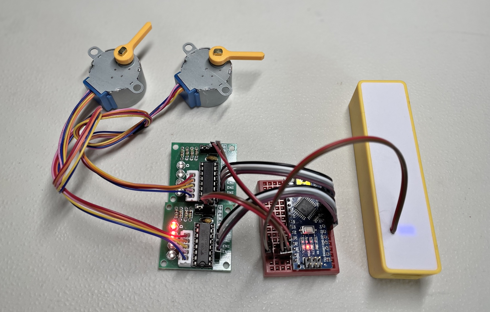

# 28BYJ-48 steppers stuff
A recopilation of **28BYJ-48** stepper motor + **ULN2003** driver *experiments*, *checks*, *analysis*, *documentation*, *models* and *data*.

**WIP**

## THE BIBLE

<iframe width="560" height="315" src="https://www.youtube.com/embed/B86nqDRskVU" title="YouTube video player" frameborder="0" allow="accelerometer; clipboard-write; encrypted-media; gyroscope; picture-in-picture" allowfullscreen></iframe>

## SCHEMAS

In the `schemas` folder:

## CODE

### PORTx vs digitalWrite()

To be able to set the four coils simultaneously we can use the [**PORTx registers**](https://web.archive.org/web/20211130201930/https://www.arduino.cc/en/Reference/PortManipulation). Also they are a lot faster (2.6x times in my example!) than the [**digitalWrite()**](https://www.arduino.cc/reference/en/language/functions/digital-io/digitalwrite/) counterpart. It's true that the code is more difficult to maintain.

Take a look at the `2X-stepper-portx.ino` and `2X-stepper-digitalwrite.ino` Arduino programs for the comparison:

    Stepper motors (ULN2003 + 28BYJ-48) driving using PORTx registers
    Maximun setCoils() time: 0
    Mode: WAVE  Delay: 2250
    Maximun setCoils() time: 28

    Stepper motors (ULN2003 + 28BYJ-48) driving using digitalWrite()
    Maximun setCoils() time: 0
    Mode: WAVE  Delay: 2250
    Maximun setCoils() time: 72

### WAVE vs FULL vs HALF driving models

There are three ways to drive a **28BYJ-48 stepper motor**. In the `visualize-driving.ino` Arduino program there is a visual demonstration on how the different driving modes operate: steps are executed very slowly as to see which coils are **on** or **off** every time.

* **WAVE**: only one active coil for each step. Good to **save energy**.
* **FULL**: two active coils at the same time for every step. Good for the **strongest torque**.
* **HALF**: alternating one or two active coils every step. You get the **finest resolution** (2x).

## 3D models

Go take a look at my [FreeCAD repository](https://github.com/mgesteiro/FreeCAD-models) for these models:

## Fritzing Parts

Go take a look at my [Fritzing repository](https://github.com/mgesteiro/fritzing-parts) for these parts:

## LICENSE

This work is licensed under the [GNU General Public License v3.0](LICENSE-GPLV30). All media and data files that are not source code are licensed under the [Creative Commons Attribution 4.0 BY-SA license](LICENSE-CCBYSA40).

More information about licenses in [Opensource licenses](https://opensource.org/licenses/) and [Creative Commons licenses](https://creativecommons.org/licenses/).