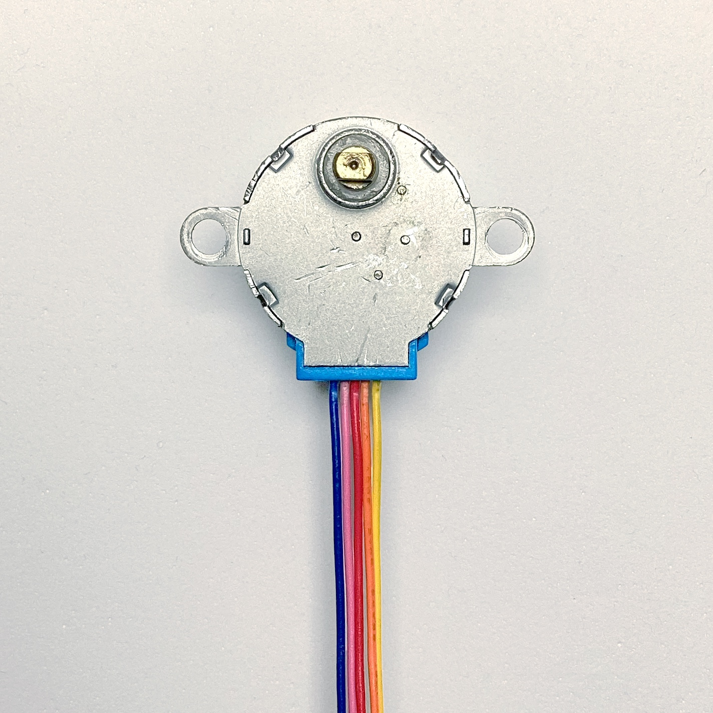
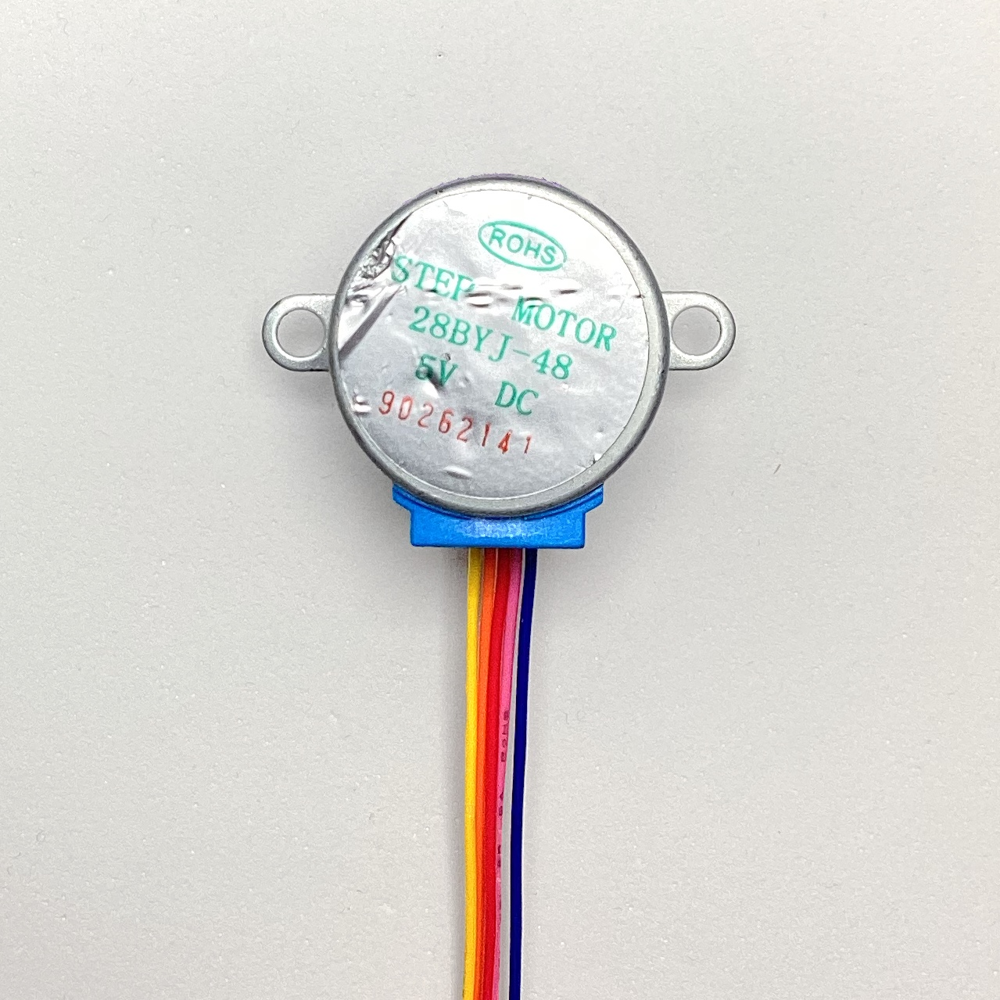
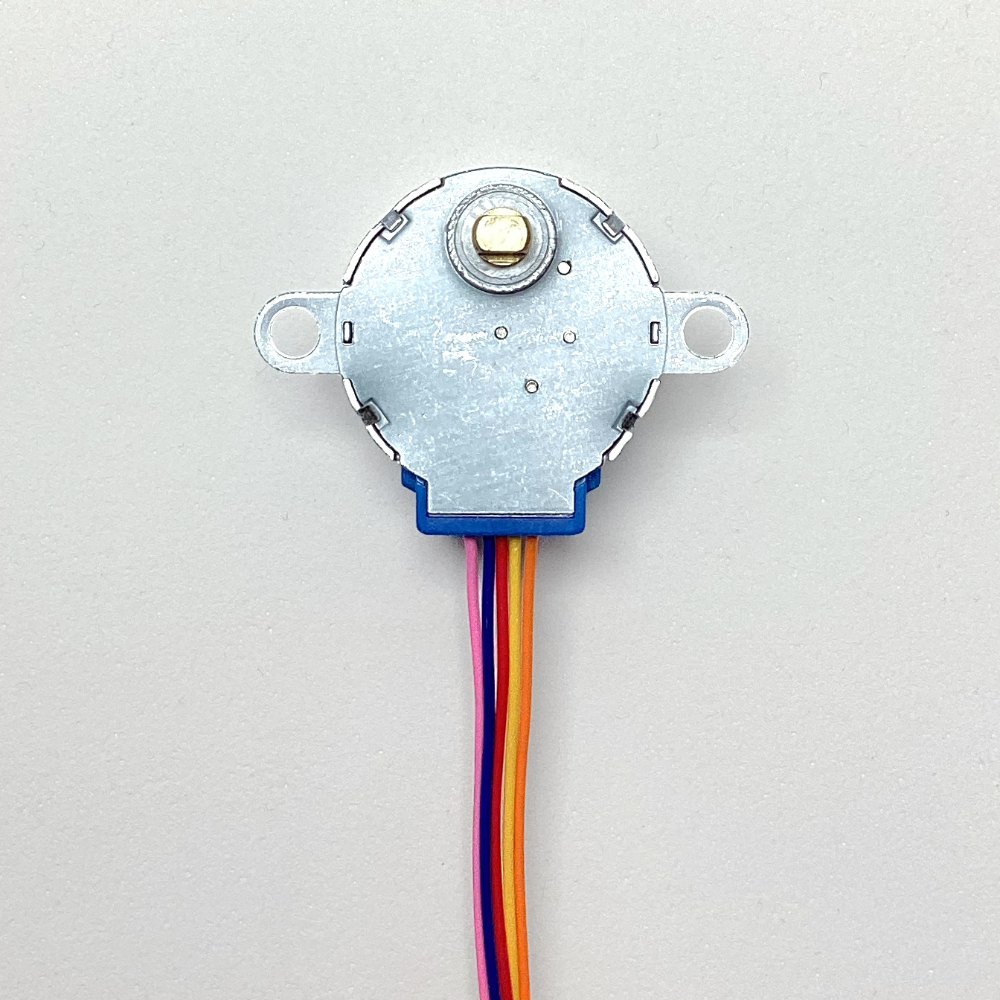
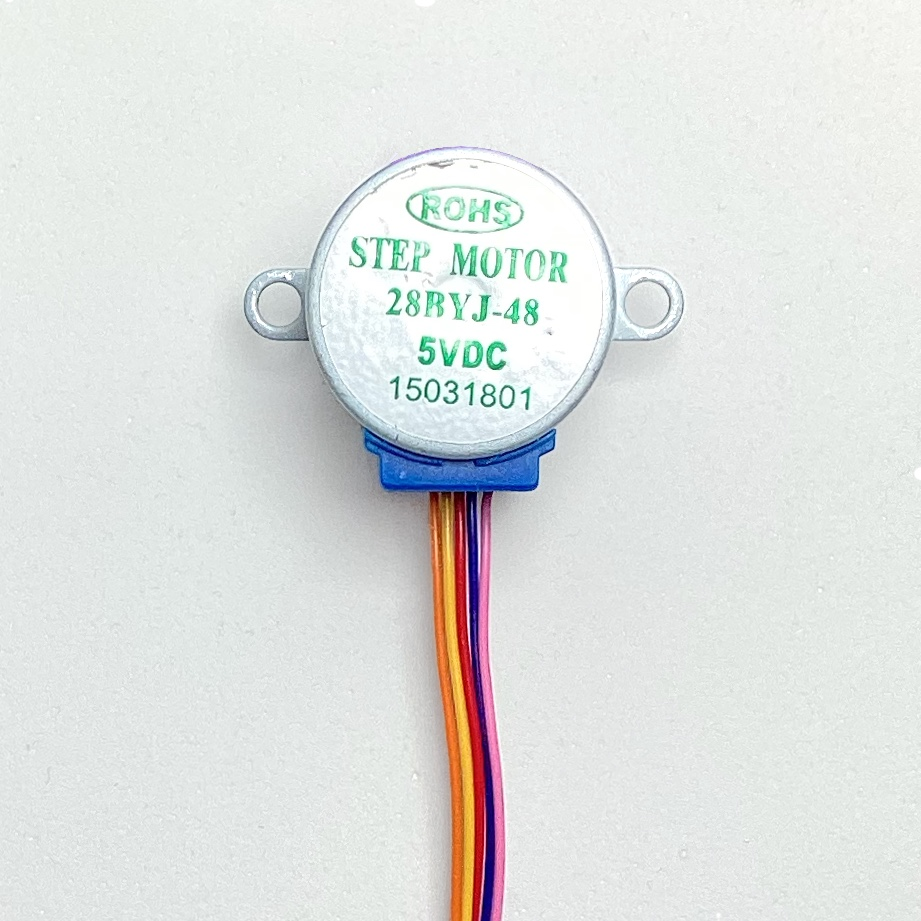
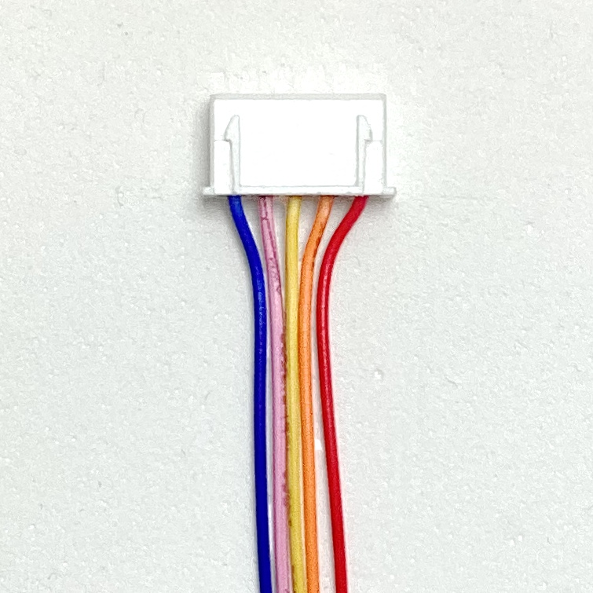
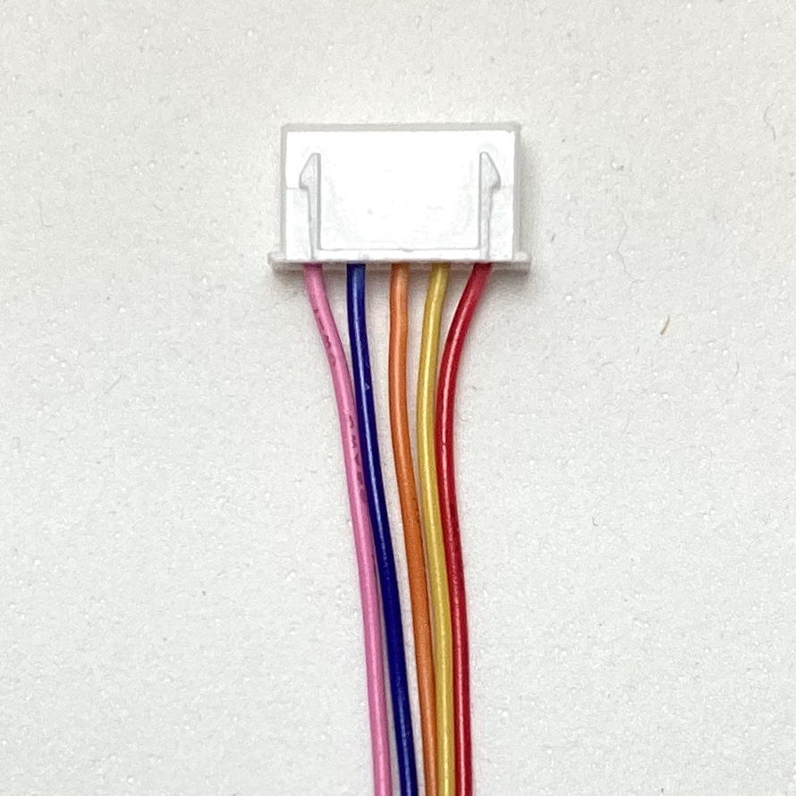
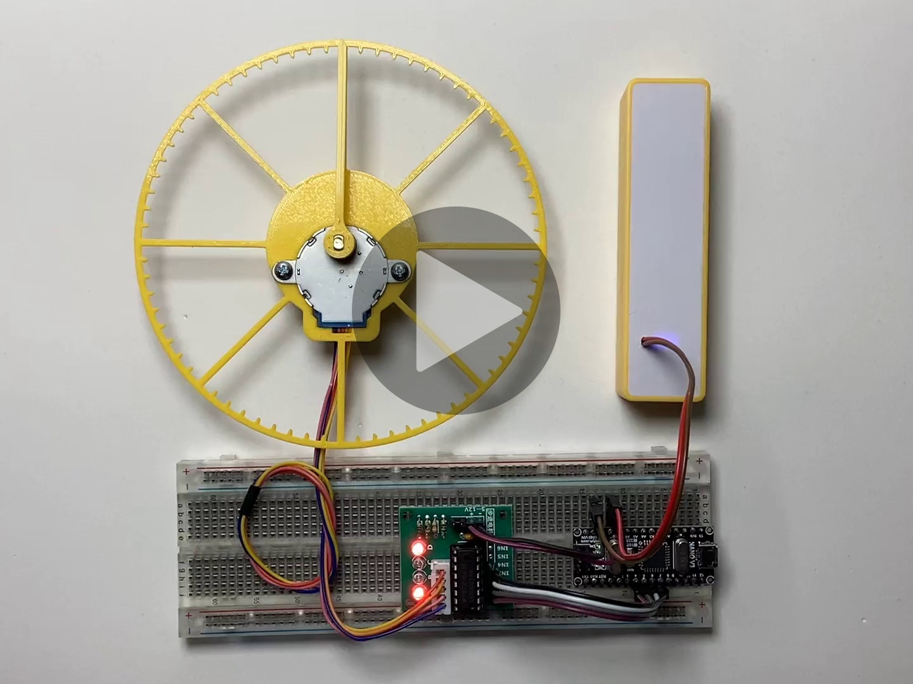

# 28BYJ-48 steppers stuff (WIP)
A recopilation of **28BYJ-48** stepper motor + **ULN2003** driver *experiments*, *checks*, *analysis*, *documentation*, *models* and *data*, mainly for our own knowledge and reference as we use them **a lot** in projects like [**Escornabot Luci**](https://github.com/roboteach-es/escornabot-luci). Feel free to explore the contents of this repository, and if you have any sugestion, please, contact us!

This is the *testing equipment* I've been using: Arduino Nano, 5V Powerbank (modified) and two 28BYJ-48 stepper motor + ULN2003 driver module. [Connection schema](#schemas) available in the `schemas` folder.

## "THE" BIBLE
This is, in my opinion, one of the best explanations about the **28BYJ-48 + ULN2003** stepper motor + driver combo, by [Bret Stateham](https://github.com/BretStateham):

There is also a very complete web page with very detailed information and explanations 
about the 28BYJ-48 stepper motor here:
[https://cookierobotics.com/042/](https://cookierobotics.com/042/)

## INFO

28BYJ-48 is an inexpensive unipolar stepper motor with 4 phases and 5 wire connection,
normally driven using a ULN2003 Darlington transistors array IC.

### Gears

The 28BYJ-48 comes with an integrated reduction gear box, available, at least, in two different configurations (ratios): the most common **64:1** and the not so common **16:1**.

In the most common version, this is how each gear connects with the following (in order):

* Motor shaft: 9 teeth
* 1st gear: 32/11 teeth (32:9 ratio with previous)
* 2nd gear: 22/9 teeth (22:11 ratio with previous)
* 3rd gear: 26/10 teeth (26:9 ratio with previous)
* Output shaft: 31 teeth (31:10 ratio with previous)

	`Final Ratio = 32/9 * 22/11 * 26/9 * 31/10 = ~63,6840  ~64:1`

### Stepping

The motor shaft has attached a cylindrical permanent magnet (8 pairs of north-south
poles). Surrounding it, there are two coils in
[unipolar configuration](https://en.wikipedia.org/wiki/Stepper_motor#Unipolar_motors)
(i.e., with a common middle connection point), which implies 4 different phases.

The same casing metal is used as the electromagnetic core for the coils:

* 32 small metal tabs (or *claws* or *teeth*)
* spread evenly across 360° (11,25° separate each two tabs)
* intermixed and distributed in two layers (1 per coil): 8x8 - 8x8

**Stepping modes:**
* Wave: one phase each time (4-step sequence)
* Full: two phases each time (4-step sequence)
* Half: alternating one and two phases (8-step sequence)

**Additional stepping info:**
* Internal motor step angle in 4-step sequence: 11.25° (32 steps per revolution)
* Internal motor step angle in 8-step sequence: 5.625° (64 steps per revolution)
* Steps per output shaft revolution in 4-step sequence: 32 * 63,6840 = 2037,8864 (~2038)
* Steps per output shaft revolution in 8-step sequence: 64 * 63,6840 = 4075,7728 (~4076)
* Frequency: 100Hz
* Idle In-traction Frequency: > 600Hz
* Idle Out-traction Frequency: > 1000Hz
* In-traction Torque: > 34.3 mN·m (120Hz) 
* Self-positioning Torque: > 34.3 mN·m
* Friction torque: 600-1200 gf·cm
* Pull in torque: 300 gf·cm

### Electrical characteristics
* Number of phase: 4
* Rated voltage: 5V DC (there are 12V versions too)
* Current consumption (measured at the the ULN2003 driver module entry point): ~165 mA one
  phase powered, ~315 mA two, ~450 mA three, ~570 mA all four
* DC resistance: 50 Ω ± 7% per coil (25°C)
* Insulated resistance: > 10 MΩ (500 V)
* Insulated electricity power: 600 VAC / 1 mA / 1 s
* Insulation grade: A
* Wiring: see the [section bellow](#wiring)

### Other parameters
* Rise in Temperature: < 40 K (120Hz)
* Noise: < 35 dB (120Hz, No load, 10cm)
* Weight: 30g

### Datasheets
Some datasheet documents are available in the `datasheet` folder.

## WIRING
If we *believe* what the \[*only one I could find all over the Internet*\] [28BYJ-48 Datasheet](datasheet/28BYJ-48-5VDC.pdf) says, the wiring should be:

	A (Pink), B (Blue), C (Orange), D (Yellow) and Common/Vcc (Red)

But, in my own experience, the **most common** order is:

	A (Blue), B (Pink), C (Yellow), D (Orange), Common/Vcc (Red)

In the *real world* I've come to find different combinations, where the wiring order comming out of the stepper itself, and the order at the JST connector in the end, may be any of the following:

The Red (common/Vcc) wire is always in the same place (middle at the stepper, to the right in the connector), but Blue/Pink and Yellow/Orange may come swapped between them and, depending if they come swapped at both ends or not, you may get different movement (or not).

We've seen really strange/weird *cases*, but usually, in practical terms, the stepper-motors behave in two different ways:

* _**normal**_: i.e., as your code expects (nothing to do)
* _**swapped**_: motors turn inverted (swapp the Blue/Pink and Yellow/Orange coils/pins, in your code or connections, to solve it)

## SCHEMAS

In the `schemas` folder, created with the open-source software [Fritzing](https://fritzing.org):

Connection schema of my *testing equipment*.

## CODE

### PORTx vs digitalWrite()

To be able to set the four coils **simultaneously** we can use the [**PORTx registers**](https://docs.arduino.cc/hacking/software/PortManipulation). Also it is a lot faster (2.6x times in my example!) than the [**digitalWrite()**](https://www.arduino.cc/reference/en/language/functions/digital-io/digitalwrite/) counterpart. It's true that the code is more difficult to maintain.

Take a look at the `2X-stepper-portx.ino` and `2X-stepper-digitalwrite.ino` Arduino programs for the comparison:

	Stepper motors (ULN2003 + 28BYJ-48) driving using PORTx registers
	Maximun setCoils() time: 0
	Mode: WAVE  Delay: 2250
	Maximun setCoils() time: 28

	Stepper motors (ULN2003 + 28BYJ-48) driving using digitalWrite()
	Maximun setCoils() time: 0
	Mode: WAVE  Delay: 2250
	Maximun setCoils() time: 72

### WAVE vs FULL vs HALF driving models

There are three ways to drive a **28BYJ-48 stepper motor**. In the `visualize-driving.ino` Arduino program there is a visual demonstration on how the different driving modes operate: steps are executed very slowly so you can see which coils are **on** or **off** every step.

* **WAVE**: 4-step sequence with only one active coil for each step. Good to **save energy**.
* **FULL**: 4-step sequence with two active coils at the same time for every step. Good for the **strongest torque**.
* **HALF**: 8-step sequence with alternating one or two active coils every step. You get the **finest resolution** (2x).

### FULL ROTATION

In **full drive mode**, the theoretical number of steps to perform a full output shaft rotation is **2037,8864** (not even a integer number!), but in the *practical world*, that number is a little higher (**2048**) as you can see in the test code ( `full-rotation.ino`) and the following video:

This difference may be caused by different factors: manufacturing, missed steps, etc. but mostly due to mechanical tolerances. The motor shaft, and the gearbox have some play, as the teeth engagement in every gear with the next isn't perfect, getting up to 4 to 6° of play in the output shaft.

In the [EscornabotEXT](https://gitlab.com/xoan/escornabot-extlib/-/blob/master/src/EscornabotEXT.cpp#L135) and [Mirobot](https://github.com/mirobot/mirobot-arduino/blob/master/src/Mirobot.cpp#L207)'s code, they deal with this issue with _**anti-slack**_ routines.

The code and the 3D printable models for this test are available in their respective folders in case you want to calibrate your own stepper motors.

## 3D models

The **dial** and the **hand** models are available in the [`3D` folder](3D). You can also take a look at my [FreeCAD repository](https://github.com/mgesteiro/FreeCAD-models) for these other models:

## Fritzing Parts

Go take a look at my [Fritzing repository](https://github.com/mgesteiro/fritzing-parts) for these parts:

## REFERENCES

* Bret Stateham video about the 28BYJ-48 stepper motor + ULN2003 driver module combo: [https://youtu.be/B86nqDRskVU](https://youtu.be/B86nqDRskVU)
* Bret Stateham github: [https://github.com/BretStateham](https://github.com/BretStateham)
* CookieRobotics info about the 28BYJ-48 stepper motor: [https://cookierobotics.com/042/](https://cookierobotics.com/042/)
* Unipolar configuration for stepper motors: [https://en.wikipedia.org/wiki/Stepper_motor#Unipolar_motors](https://en.wikipedia.org/wiki/Stepper_motor#Unipolar_motors)
* **PORTx registers** (a.k.a. PORT manipulation) in Arduino: [https://docs.arduino.cc/hacking/software/PortManipulation](https://docs.arduino.cc/hacking/software/PortManipulation)
* **digitalWrite()** in Arduino: [https://www.arduino.cc/reference/en/language/functions/digital-io/digitalwrite/](https://www.arduino.cc/reference/en/language/functions/digital-io/digitalwrite/)
* BitMath Arduino tutorial: [https://playground.arduino.cc/Code/BitMath/](https://playground.arduino.cc/Code/BitMath/)
* My FreeCAD 3D models repository: [https://github.com/mgesteiro/FreeCAD-models](https://github.com/mgesteiro/FreeCAD-models)
* My Fritzing parts repository: [https://github.com/mgesteiro/fritzing-parts](https://github.com/mgesteiro/fritzing-parts)
* **FreeCAD** 3D CAD modelling software: [https://www.freecad.org](https://www.freecad.org)
* **Fritzing** schematics and PCB modelling software: [https://fritzing.org](https://fritzing.org)

## LICENSE

This work is licensed under the [GNU General Public License v3.0](LICENSE-GPLV30). All media and data files that are not source code are licensed under the [Creative Commons Attribution 4.0 BY-SA license](LICENSE-CCBYSA40).

More information about licenses in [Opensource licenses](https://opensource.org/licenses/) and [Creative Commons licenses](https://creativecommons.org/licenses/).